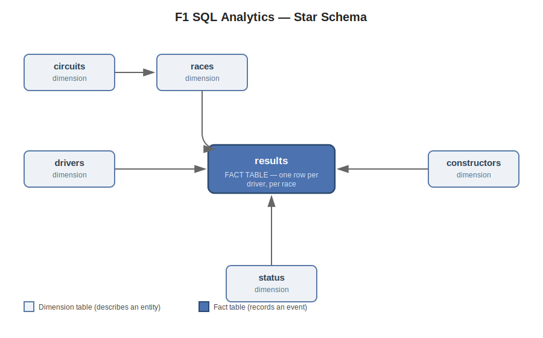

# F1 SQL Analytics

A SQL-first analytics tool built on 75 years of Formula 1 historical data — demonstrating a full pipeline from raw CSVs to a normalized relational schema to SQL analysis (joins, CTEs, window functions) to visualization.

## Architecture — star schema
 

`results` is the fact table — one row per driver, per race. Everything else describes an entity (who, where, why), not an event. This shape is the same pattern used in real analytics warehouses (a sales fact table surrounded by customer/product/store dimensions) — F1 results stand in for any general operational analytics problem.

| Table | Rows | Role |
|---|---|---|
| `drivers` | 861 | dimension |
| `constructors` | 212 | dimension |
| `circuits` | 77 | dimension |
| `status` | 139 | dimension (finish/DNF reason lookup) |
| `races` | 1,125 | dimension (season/round/circuit) |
| `results` | 26,759 | **fact** — one row per driver per race |

## Tech stack & key decisions

- **Raw `sqlite3`**, not SQLAlchemy — the project's purpose is to demonstrate hand-written SQL (joins, CTEs, window functions), not an ORM's query builder. For a single-developer local analytics tool, this is the right tradeoff; a production system needing multi-backend support would reasonably choose SQLAlchemy instead.
- **pandas** for cleaning (at load time) and as the DataFrame container query results land in.
- **matplotlib / seaborn** for visualization.
- **pytest**, with an in-memory (`:memory:`) fixture database — fast, deterministic, and requires no downloaded data to run.

## Setup

```bash
git clone <your-repo-url>
cd f1-sql-analytics
python -m venv venv
source venv/bin/activate   # Windows: venv\Scripts\activate
pip install -r requirements.txt
```

Download the dataset (raw CSVs are not committed to this repo):
1. Get the "Formula 1 World Championship (1950–2024)" dataset from Kaggle
2. Extract it into `data/raw/f1db_csv/`

Build and load the database:
```bash
python src/load_data.py
```

Run tests:
```bash
pytest tests/ -v
```

## Usage — CLI

```bash
python src/main.py wins --min-year 2018
python src/main.py points --year 2021 --drivers Hamilton Verstappen
python src/main.py grid --year 2023
python src/main.py --help
```

## Example queries

**Window function — cumulative championship points, race by race:**
```sql
SELECT
    d.surname AS driver,
    r.round,
    SUM(res.points) OVER (
        PARTITION BY d.driver_id ORDER BY r.round
    ) AS cumulative_points
FROM results res
JOIN races r ON res.race_id = r.race_id
JOIN drivers d ON res.driver_id = d.driver_id
WHERE r.year = 2021 AND d.surname IN ('Hamilton', 'Verstappen');
```

**CTE + window function — championship runner-up by season:**
```sql
WITH season_points AS (
    SELECT d.surname AS driver, r.year, SUM(res.points) AS total_points
    FROM results res
    JOIN races r ON res.race_id = r.race_id
    JOIN drivers d ON res.driver_id = d.driver_id
    GROUP BY d.driver_id, r.year
),
ranked_standings AS (
    SELECT driver, year, total_points,
        RANK() OVER (PARTITION BY year ORDER BY total_points DESC) AS season_rank
    FROM season_points
)
SELECT year, driver, total_points
FROM ranked_standings
WHERE season_rank = 2
ORDER BY year DESC;
```

**Self-join → replaced by `LAG()`** — see `src/queries.py` for both versions side by side; a good example of how window functions simplify logic that would otherwise require a self-join.

## Sample output

png)

Points below the diagonal line gained positions during the race; points above lost positions. Starting position predicts finishing position most strongly at the extremes of the grid — the midfield (positions 6–15) shows far more volatility.

## Known limitations

- **Sprint race points (2021+) are not included.** Points totals are computed from `results` only; `sprint_results.csv` was not loaded, so season point totals in 2021+ will be slightly lower than official standings (verified against the 2021 Hamilton/Verstappen title fight — our totals were off by ~2–7 points due to this gap).
- Session-timing metadata (FP1/FP2/FP3/qualifying/sprint timestamps) was intentionally excluded from the `races` schema — not needed for the analytical questions this project answers.

## What I'd add next

- Load `sprint_results.csv` and union sprint points into season totals
- A `pit_stops`/`lap_times`-driven analysis (lap-by-lap gap to leader, using `LAG()`)
- Parameterize queries properly (`?` placeholders) instead of f-string interpolation, to eliminate the SQL-injection-shaped pattern currently used for driver-name filtering
- CI (GitHub Actions) running `pytest` on every push
EOF

